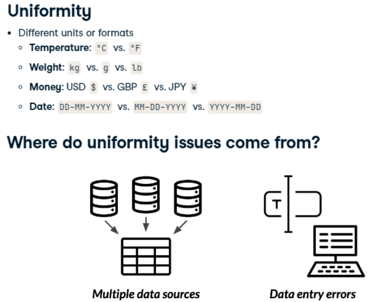
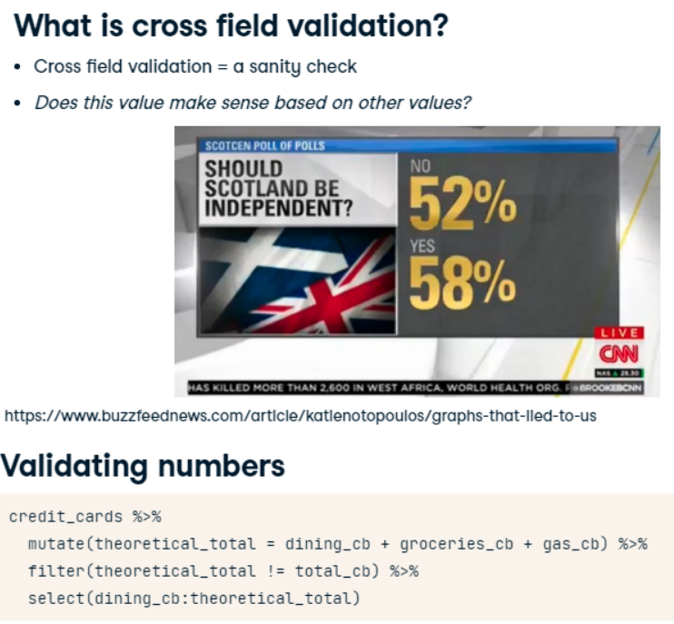
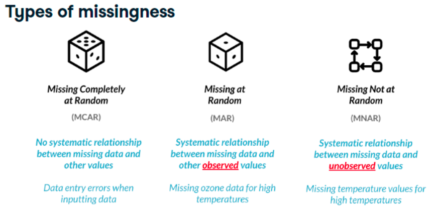
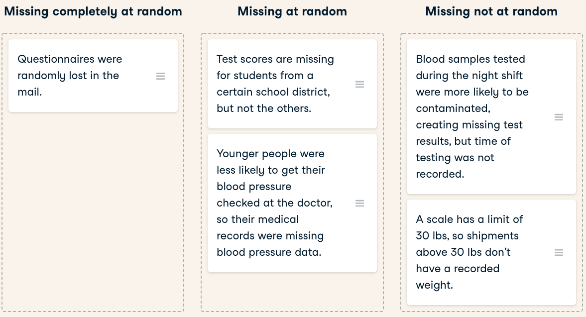

```{r setup, include=FALSE}
knitr::opts_chunk$set(include = TRUE)
knitr::opts_chunk$set(echo = TRUE)
options(digits = 3)

library(data.table)
library(readr)
library(dplyr)    # for glimpse()
library(assertive)
library(stringr)
library(ggplot2)
library(tinytex)
```


# Types of Problems


{width=75%}

# Uniformity

## Date Uniformity

{width=35%}

__Parsing Multiple Date Formats__

> library(lubridate)  
> parse_date_time(df$date,   
>
> > orders = c("%Y-%m-%d", "%m-%d-%y",  "%B %d, %Y"))

n this chapter, you work at an asset management company and you'll be working with the `accounts` dataset, which contains information about each customer, the amount in their account, and the date their account was opened. Your boss has asked you to calculate some summary statistics about the average value of each account and whether the age of the account is associated with a higher or lower account value. Before you can do this, you need to make sure that the accounts dataset you've been given doesn't contain any uniformity problems. In this exercise, you'll investigate the _date_opened_ column and clean it up so that all the dates are in the same format.


1. Convert the dates in the date_opened column to the same format using the formats vector and store this as a new column called date_opened_clean.  

```
# Define the date formats
formats <- c("%Y-%m-%d", "%B %d, %Y")

# Convert dates to the same format
accounts %>%
  mutate(date_opened_clean = parse_date_time(date_opened, orders = formats))
```

## Currency uniformity
Now that your dates are in order, you'll need to correct any unit differences. When you first plot the data, you'll notice that there's a group of very high values, and a group of relatively lower values. The bank has two different offices - one in New York, and one in Tokyo, so you suspect that the accounts managed by the Tokyo office are in Japanese yen instead of U.S. dollars. Luckily, you have a data frame called account_offices that indicates which office manages each customer's account, so you can use this information to figure out which totals need to be converted from yen to dollars.

The formula to convert yen to dollars is $USD = \frac{JPY}{104}$.

dplyr and ggplot2 are loaded and the accounts and account_offices data frames are available.

1. Create a scatter plot with date_opened on the x-axis and total on the y-axis.  
2. Left join accounts and account_offices by their id columns.  
3. Convert the _totals_ from the Tokyo office from yen to dollars, and keep the total from the New York office in dollars. Store this as a new column called total_usd.  
4. Create a scatter plot of your new uniform data using date_opened on the x-axis and total_usd on the y-axis.   

```
# Scatter plot of opening date and total amount
accounts %>%
  ggplot(aes(x = date_opened, y = total)) +
  geom_point()

# Left join accounts to account_offices by id
accounts %>%
  left_join(account_offices, by = "id") %>%
  # Convert totals from the Tokyo office to USD
  mutate(total_usd = ifelse(office == "Tokyo", total / 104, total)) %>%
  # Scatter plot of opening date vs total_usd
  ggplot(aes(x = date_opened, y = total_usd)) +
    geom_point()
```


# Cross Field Validation

{width=75%}

## Validating totals
In this lesson, you'll continue to work with the accounts data frame, but this time, you have a bit more information about each account. There are three different funds that account holders can store their money in. In this exercise, you'll validate whether the total amount in each account is equal to the sum of the amount in fund_A, fund_B, and fund_C. If there are any accounts that don't match up, you can look into them further to see what went wrong in the bookkeeping that led to inconsistencies.

1. Create a new column called theoretical_total that contains the sum of the amounts in each fund. 
2. Find the accounts where the total doesn't match the theoretical_total.  

```
# Find invalid totals
accounts %>%
  # theoretical_total: sum of the three funds
  mutate(theoretical_total = fund_A + fund_B + fund_C) %>%
  # Find accounts where total doesn't match theoretical_total
  filter(total != theoretical_total)
```

## Validating age

__Calculating Age Difference__
> library(libridate)
> date_diff <- as.Date("2015-04-21") %--% today()
> as.numeric(date_diff, "years")

Now that you found some inconsistencies in the total amounts, you're suspicious that there may also be inconsistencies in the acct_age column, and you want to see if these inconsistencies are related. Using the skills you learned from the video exercise, you'll need to validate the age of each account and see if rows with inconsistent acct_ages are the same ones that had inconsistent totals

1. Create a new column called _theoretical_age_ that contains the age of each account based on the date_opened.  
2. Find the accounts where the _acct_age_ doesn't match the _theoretical_age_  

```
# Find invalid acct_age
accounts %>%
  # theoretical_age: age of acct based on date_opened
  mutate(theoretical_age = floor(
          as.numeric(date_opened %--% today(), "years" )
          ) ) %>%
  # Filter for rows where acct_age is different from theoretical_age
  filter(theoretical_age != acct_age)
```

# Completeness



__Examples__  



## Investigating Missing Values  

> library(visdat)  
> vis_mis(airquality)

=> "Ozone" var has missing values

```{r}
data("airquality")
airquality %>% 
  mutate(missing_ozone = is.na(Ozone)) %>% 
  group_by(missing_ozone)  %>% 
  summarise_all(mean, na.rm = TRUE)

```


Dealing with missing data is one of the most common tasks in data science. There are a variety of types of missingness, as well as a variety of types of solutions to missing data.

You just received a new version of the accounts data frame containing data on the amount held and amount invested for new and existing customers. However, there are rows with missing _inv_amount_ values.

You know for a fact that most customers below 25 do not have investment accounts yet, and suspect it could be driving the missingness. The dplyr and visdat packages have been loaded and accounts is available.

1. Add a logical column to accounts called missing_inv that indicates whether each row is missing the _inv_amount_ or not.
Group by missing_inv.  
2. Calculate the mean age for each group of missing_inv. 

> summarise( .data, . . .)
>
> > . . .	
<data-masking> Name-value pairs of summary functions.  
> > The name will be the name of the variable in the result.


```
# Visualize the missing values by column
vis_miss(accounts)

accounts %>%
  # missing_inv: Is inv_amount missing?
  mutate(missing_inv = is.na(inv_amount)) %>%
  # Group by missing_inv
  group_by(missing_inv) %>%
  # Calculate mean age for each missing_inv group
  summarise(avg_age = mean(age))
```
  missing_inv avg_age
  <lgl>         <dbl>
1 FALSE          43.6
2 TRUE           21.8

3. Sort accounts by age.  
4. Visualize missing data by column.  

> arrange(.data, ..., .by_group = FALSE)

```
# Sort by age and visualize missing vals
accounts %>%
  arrange(age) %>%
  vis_miss()
```

Fabulous visualizations! Investigating summary statistics based on missingness is a great way to determine if data is missing completely at random or missing at random.

## Dealing with Missing Data

In this exercise, you're working with another version of the accounts data that contains missing values for both the _cust_id_ and _acct_amount_ columns.

You want to figure out how many unique customers the bank has, as well as the average amount held by customers. You know that rows with missing _cust_id_ don't really help you, and that on average, the acct_amount is usually 5 times the amount of inv_amount.

In this exercise, you will __drop rows__ of accounts with missing cust_ids, and impute missing values of inv_amount with some domain knowledge. dplyr and assertive are loaded and accounts is available.

1. Filter accounts to remove rows with missing cust_ids and save as accounts_clean.  

2. Create a new column called _acct_amount_filled_, which contains the values of acct_amount, except all NA values should be replaced with 5 times the amount in inv_amount.  

3. Assert that there are no missing values in the _cust_id_ column of `accounts_clean`  

```
# Create accounts_clean
accounts_clean <- accounts %>%

  # Filter to remove rows with missing cust_id
  filter(!is.na(cust_id))

  # Add new col acct_amount_filled with replaced NAs
  mutate(acct_amount_filled = 
      ifelse(is.na(acct_amount), 
              5 * inv_amount,     
              acct_amount))
# Assert that cust_id has no missing vals
assert_all_are_not_na(accounts_clean$cust_id)

# Assert that acct_amount_filled has no missing vals
assert_all_are_not_na(accounts_clean$acct_amount_filled)

```

