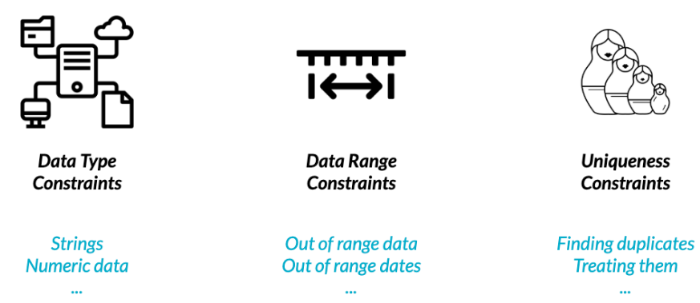
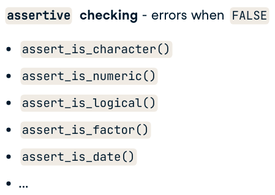
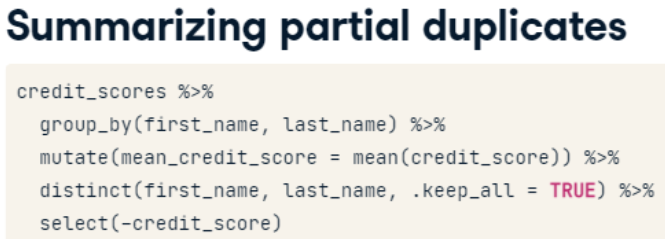

```{r setup, include=FALSE}
knitr::opts_chunk$set(include = TRUE)
knitr::opts_chunk$set(echo = TRUE)
options(digits = 3)

library(data.table)
library(readr)
library(dplyr)    # for glimpse()
library(assertive)
library(stringr)
library(ggplot2)
library(tinytex)
```

{width=100%}

# Data Type Constraints

## Converting data types

Throughout this chapter, you'll be working with San Francisco bike share ride data called bike_share_rides.
It contains information on start and end stations of each trip, the trip duration, and some user information.

**Defensive Programming**\
{width="50%"}

ref: <https://campus.datacamp.com/courses/cleaning-data-in-r/common-data-problems?ex=1>

Before beginning to analyze any dataset, it's important to take a look at the different types of columns you'll be working with, which you can do using `glimpse()`.

In this exercise, you'll take a look at the data types contained in bike_share_rides and see how an incorrect data type can flaw your analysis.

`dplyr` and `assertive` are loaded and bike_share_rides is available.

Examine the data types of the columns of bike_share_rides.
Get a summary of the user_birth_year column of bike_share_rides.

-   Dataset
-   Downloaded from <https://www.kaggle.com/benhamner/sf-bay-area-bike-share?select=trip.csv>
-   need to be logged in to kaggle to access

```{r, warning=FALSE, message=FALSE}

bike_share_rides <- read_csv("./data/trip.csv",
                  n_max = 35229) %>% 
  as.data.table

# problems(bike_share_rides)

# Glimpse at bike_share_rides
summary(bike_share_rides)

```

-   `factor` data type bike_share_rides dataset contains the variable `subscription_type` which needs to be converted from `character` to `factor`

-   This variable groups each trip according to year and is a categorical variable.

1.  Add a new column to bike_share_rides called subscription_type_fct.
2.  Assert that the subscription_type_fct is a factor to confirm the conversion.

```{r}
bike_share_rides[ , subscription_type_fct := as.factor(subscription_type)]
assert_is_factor(bike_share_rides$subscription_type_fct)
# Summary 
summary(bike_share_rides$subscription_type_fct)
```

Dapper data type dexterity!
In the previous exercise, you were able to identify the correct data type and convert `subscription_type` to the correct data type, allowing you to extract counts that gave you a bit more insight into the dataset.

-   Trimming strings

Suppose we have a variable: `$ duration         <chr> "1316.15 minutes", "8.13 minutes", "24.85 minutes"...`

Another common dirty data problem is having extra bits like percent signs or periods in numbers, causing them to be read in as characters.
In order to be able to crunch these numbers, the extra bits need to be removed and the numbers need to be converted from character to numeric.
In this exercise, you'll need to convert the duration column from character to numeric, but before this can happen, the word "minutes" needs to be removed from each value.

dplyr, assertive, and stringr are loaded and bike_share_rides is available.

1.  Use str_remove() to remove "minutes" from the duration column of bike_share_rides.
    Add this as a new column called duration_trimmed.

2.  Convert the duration_trimmed column to a numeric type and add this as a new column called duration_mins.

3.  Glimpse at bike_share_rides and assert that the duration_mins column is numeric.

<!-- -->

    bike_share_rides <- bike_share_rides %>%
      mutate(duration_trimmed = str_remove(duration, "minutes"),
             duration_mins = as.numeric(duration_trimmed))

    # Glimpse at bike_share_rides
    glimpse(bike_share_rides)

    # Assert duration_mins is numeric
    assert_is_numeric(bike_share_rides$duration_mins)

-   Inspect local bike_share_rides dataset

```{r}
bike_share_rides[, summary(duration)]
```

Convert `duration` from seconds to minutes.

```{r}
bike_share_rides[ , duration_min := duration / 60]

assert_is_numeric(bike_share_rides$duration_min)
```

# Range Constraints

-   Handling out of range values

1.  Remove rows\
2.  Replace with range limit\
3.  Treat as NA\
4.  Replace with value based on domain knowledge

**1. Remove Rows**

Consider imbd film ratings - values are between 0 and 5.

    films %>% 
      filter(avg_rating >= 0, avg_rating <=5) %>% 
      ggplot(aes(avg_rating)) +
        geom_histogram(breaks = 
          c(min(avg_rating), 0, 5, max(avg_rating)))

**2 Replace with range limit**

-   Ride duration constraints

> replace(col, condition, replacement)

Values that are out of range can throw off an analysis, so it's important to catch them early on.
In this exercise, you'll be examining the `duration_min` column more closely.
Bikes are not allowed to be kept out for more than 24 hours, or 1440 minutes at a time, but issues with some of the bikes caused inaccurate recording of the time they were returned.

In this exercise, you'll replace erroneous data with the range limit (1440 minutes), however, you could just as easily replace these values with NAs.

dplyr, assertive, and ggplot2 are loaded and bike_share_rides is available.

1.  Create a three-bin histogram of the `duration_min` column of bike_share_rides using ggplot2 to identify if there is out-of-range data.

```{r}
# Create breaks
fivenum(bike_share_rides$duration_min)

breaks <- c(min(bike_share_rides$duration_min), 1440, max(bike_share_rides$duration_min))

# Create a histogram of duration_min
ggplot(bike_share_rides, aes(duration_min)) +
  geom_histogram(breaks = breaks)
```

2.  Replace the values of duration_min that are greater than 1440 minutes (24 hours) with 1440. Add this to bike_share_rides as a new column called duration_min_const.\
3.  Assert that all values of duration_min_const are between 0 and 1440.

```{r}
bike_share_rides[ , duration_min_const := 
                    replace(duration_min, 
                            duration_min > 1440, 
                           1440) ]
assert_all_are_in_closed_range(bike_share_rides$duration_min_const, 
                               lower = 0,
                               upper = 1440)
```

-   **Back to the future**\
    Something has gone wrong and it looks like you have data with dates from the future, which is way outside of the date range you expected to be working with. To fix this, you'll need to remove any rides from the dataset that have a date in the future. Before you can do this, the date column needs to be converted from a character to a `Date`. Having these as `Date` objects will make it much easier to figure out which rides are from the future, since R makes it easy to check if one Date object is before (\<) or after (\>) another.

> assert_all_in_past()

dplyr and assertive are loaded and bike_share_rides is available.

1.  Convert the date column of bike_share_rides from character to the `Date` data type.\

2.  Assert that all values in the date column happened sometime in the past and not in the future.

3.  Filter `bike_share_rides` to get only the rides from the past or today, and save this as bike_share_rides_past.\

4.  Assert that the dates in bike_share_rides_past occurred only in the past.

<!-- -->

    library(lubridate)
    # Convert date to Date type
    bike_share_rides <- bike_share_rides %>%
      mutate(start_date = as.Date(start_date))

    # Make sure all dates are in the past
    assert_all_are_in_past(bike_share_rides$date)

    # Filter for rides that occurred before or on today's date
    bike_share_rides_past <- bike_share_rides %>%
      filter(date < today())

    # Make sure all dates from bike_share_rides_past are in the past
    assert_all_are_in_past(bike_share_rides_past$date)

"Fabulous filtering! Handling data from the future like this is much easier than trying to verify the data's correctness by time traveling."

**3 Treat as NA**

> replace(col, condition, replacement)

**4 Replace with value based on domain knowledge**

# Uniqueness Constraints

**Why do duplicates occur?**


## Full duplicates

> Finding full duplicates duplicated(credit_score) %\>% sum()
>
> filter(credit_score, duplicated(credit_score)

You've been notified that an update has been made to the bike sharing data pipeline to make it more efficient, but that duplicates are more likely to be generated as a result.
To make sure that you can continue using the same scripts to run your weekly analyses about ride statistics, you'll need to ensure that any duplicates in the dataset are removed first.

When multiple rows of a data frame share the same values for all columns, they're full duplicates of each other.
Removing duplicates like this is important, since having the same value repeated multiple times can alter summary statistics like the mean and median.
Each ride, including its ride_id should be unique.

dplyr is loaded and bike_share_rides is available.

Get the total number of full duplicates in bike_share_rides.
Remove all full duplicates from bike_share_rides and save the new data frame as bike_share_rides_unique.
Get the total number of full duplicates in the new bike_share_rides_unique data frame.

    # Count the number of full duplicates
    nrow(bike_share_rides) - nrow( distinct(bike_share_rides)) 

    # Remove duplicates
    bike_share_rides_unique <- distinct(bike_share_rides)

    # Count the full duplicates in bike_share_rides_unique
    nrow(bike_share_rides_unique) - nrow( distinct(bike_share_rides_unique)) 

Dazzling duplicate removal!
Removing full duplicates will ensure that summary statistics aren't altered by repeated data points.

-   Removing partial duplicates

> credit_scores %\>% distinct(first_name, last_name, .keep_all = TRUE)

Now that you've identified and removed the full duplicates, it's time to check for partial duplicates.
Partial duplicates are a bit tricker to deal with than full duplicates.
In this exercise, you'll first identify any partial duplicates and then practice the most common technique to deal with them, which involves dropping all partial duplicates, keeping only the first.

Count the number of occurrences of each ride_id.
Filter for ride_ids that occur multiple times.

    # Find duplicated ride_ids
    bike_share_rides %>% duplicated() 
      
    # Count the number of occurrences of each ride_id
    bike_share_rides %>% 
        count( ride_id)
      
    # Filter for rows with a count > 1
    bike_share_rides %>% 
        count( ride_id) %>%
        filter(n > 1)

-   Removing partial duplicates\
    Now that you've identified and removed the full duplicates, it's time to check for partial duplicates. Partial duplicates are a bit tricker to deal with than full duplicates. In this exercise, you'll first identify any partial duplicates and then practice the most common technique to deal with them, which involves dropping all partial duplicates, keeping only the first.

1.  Remove full and partial duplicates from bike_share_rides based on ride_id only, keeping all columns. Store this as bike_share_rides_unique.\
2.  Find the duplicated ride_ids in bike_share_rides_unique.

<!-- -->

    # Find duplicated ride_ids
    bike_share_rides %>% 
      count(ride_id) %>% 
      filter(n > 1)

    # Remove full and partial duplicates
    bike_share_rides_unique <- bike_share_rides %>%
      # Only based on ride_id instead of all cols
      distinct(ride_id, .keep_all = TRUE)

    # Find duplicated ride_ids in bike_share_rides_unique
    bike_share_rides_unique %>%
      # Count the number of occurrences of each ride_id
      count(ride_id) %>%
      # Filter for rows with a count > 1
      filter(n > 1)

-   Aggregating partial duplicates



Another way of handling partial duplicates is to compute a summary statistic of the values that differ between partial duplicates, such as mean, median, maximum, or minimum.
This can come in handy when you're not sure how your data was collected and want an average, or if based on domain knowledge, you'd rather have too high of an estimate than too low of an estimate (or vice versa).

Group bike_share_rides by ride_id and date.
Add a column called duration_min_avg that contains the mean ride duration for the row's ride_id and date.
Remove duplicates based on ride_id and date, keeping all columns of the data frame.
Remove the duration_min column.

    bike_share_rides %>%
      # Group by ride_id and date
      group_by(ride_id, date) %>%
        # Add duration_min_avg column
        mutate(duration_min_avg = mean(duration_min) ) %>%
        # Remove duplicates based on ride_id and date, keep all cols
        distinct(ride_id, date, .keep_all = TRUE) %>%
        # Remove duration_min column
        select(-duration_min)
